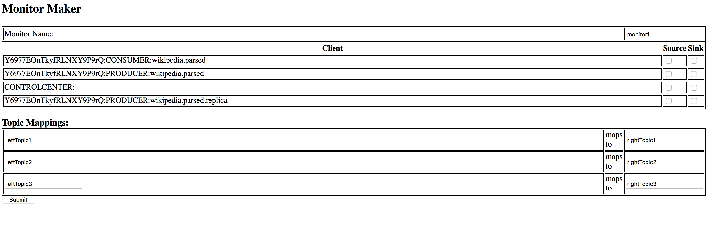
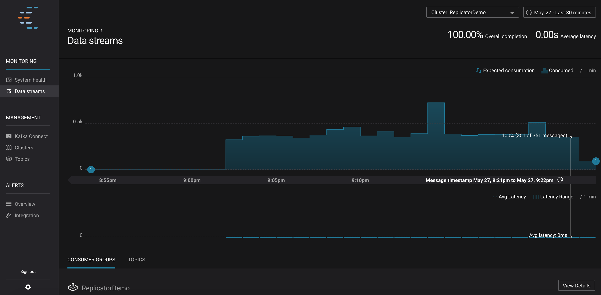
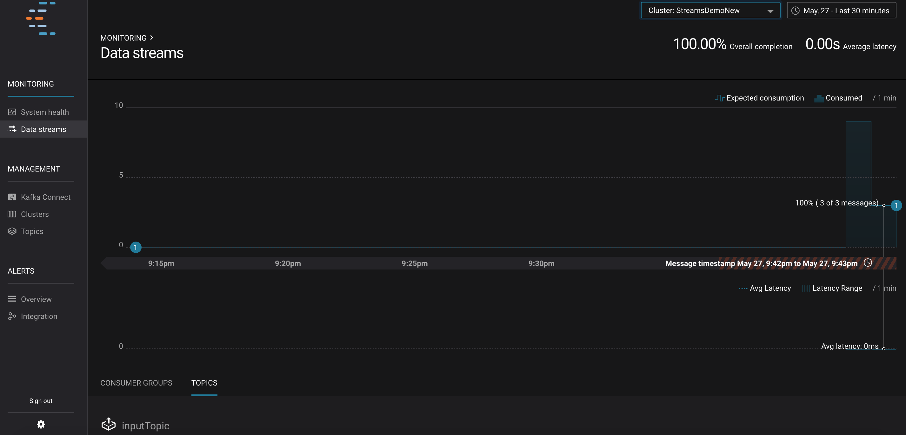

Control Center End to End Monitoring P.O.C.
=================

## Purpose ##

To provide end to end monitoring using Control Center for the following scenarios:

1. Replicator - Show message delivery from the producer to the source topic to the producer to the destination topic. This must work even when there is no consumer on the destination topic.
2. Streams - Show message delivery for streams applications. The example case used here is an application that processes messages from a single input topic and splits them to 2 output topics.

## In Scope ##

Differences in topic names as source and sink must be taken into account
The expected/actual consumption graphs will be reused to represent messages at source (expected consumption) and messages at sink (actualt consumption)

## Out of Scope ##

Latency is out of scope for this POC bnecause it is reported as 0 from producers in the current interceptor implementation.

## Building ##

```
mvn clean package
```

This creates a shaded jar with all dependencies included in thew target directory:

```
streams-configurator-1.0-SNAPSHOT.jar
```

## How it works ##

The configurator is a streams application that monitors the _confluent-monitoring topic and performs the following actions:

1. Builds a list of unique cluster ids, client types (producer/consumer) and topic names for monitoring messages provided. Note: This is enough information for this demo but actual implementation would use more infromation from the monitoring messages to determine unique clients.
2. Assigns `source` or `sink` roles to the clients identified above. 
3. When new messages come in that much the assignments above a new message is produced back to the _confluent-monitoring topic with the following changes:
  * Cluster id/name is changed to match a new cluster name chosen by the user. This is to avoid confusion in Replicator cases where the source and destination clusters are different.
  * For `source` messages the client type is changed to Producer. This is done regardless of whether the original message was for producer or consumer and forces messages to be counted towards expected consumption.
  * For `sink` messages the client type is changed to Consumer. This is done regardless of whether the original message was for producer or consumer and forces messages to be counted towards actual consumption.
  * Topics are mapped so that they match for monitoring purposes. For instance, in a replicator case, you mihgt map the destination topic name to the source topic name if they are different.   

## Demos ##

### Setup ###

All demos are run with cp-demo. The streams-configurator jar should be deployed to a place accessible by the cp-demo containers (the easiest way to do the is to put it in scripts/security which maps to /etc/kafka/secrets).

### Replicator Demo ###

#### Setup ###

```
#bring up connect
docker-compose up connect

#delete elastic search connector
curl -X DELETE localhost:8083/connectors/elasticsearch-ksql
```

#### Launch Configurator #####

```
#start configurator
cd /etc/kafka/secrets
java -cp streams-configurator-1.0-SNAPSHOT.jar com.threefi.configurator.management.MgmtServer localhost:10091 _confluent-monitoring
```

This will then spend 2 mins searching for unique clients. When this is done a simple management server is launched at localhost:9022:



Using this interface the source/sink and topic matching can be configured. Select the following:

1. The monitor name should be changed to "ReplicatorDemo"
2. \[cluster id\]:PRODUCER:wikipedia.parsed should be selected as source. This represents the client producing to the replicator source topic.
3. \[cluster id\]:PRODUCER:wikipedia.parsed.replica should be selected as sink. This represents the client producing to the replicator destination topic.
4. The following topic mapping should be applied:
  * wikipedia.parsed.replica maps to wikipedia.parsed
  
After submitting this the following monitoring can be seen in Control Center:

 


### Streams Demo ###

The Streams demo creates a sample streams a that randomly assigns messages on an input topic to one of 2 output topics. The monitoring should show that the combined message count of the 2 output topics is the same as the count on the input topic.

#### Setup ###

```
# create streams test topics
kafka-topics --zookeeper zookeeper:2181 --create --partitions 1 --replication-factor 1 --topic inputTopic
kafka-topics --zookeeper zookeeper:2181 --create --partitions 1 --replication-factor 1 --topic outputTopic1
kafka-topics --zookeeper zookeeper:2181 --create --partitions 1 --replication-factor 1 --topic outputTopic2

#start streams test
java -cp streams-configurator-1.0-SNAPSHOT.jar com.threefi.configurator.TestStreamsApp localhost:10091 inputTopic outputTopic1 outputTopic2

#launch a console produce and produce a few messages
kafka-console-producer --broker-list localhost:10091 --topic inputTopic

```

#### Launch Configurator #####

```
#start configurator
cd /etc/kafka/secrets
java -cp streams-configurator-1.0-SNAPSHOT.jar com.threefi.configurator.management.MgmtServer localhost:10091 _confluent-monitoring
```

This will then spend 2 mins searching for unique clients. When this is done a simple management server is launched at localhost:9022:


Using this interface the source/sink and topic matching can be configured. Select the following:

1. The monitor name should be changed to "StreamsDemo"
2. \[cluster id\]:CONSUMER:inputTopic should be selected as source. This represents the streams client consuming source topic.
3. \[cluster id\]:PRODUCER:outputTopic1 should be selected as sink. This represents the streams client producing to an output topic.
4. \[cluster id\]:PRODUCER:outputTopic2 should be selected as sink. This represents the streams client producing to an output topic.
4. The following topic mapping should be applied:
  * outputTopic1 maps to inputTopic
  * outputTopic2 maps to inputTopic
  
After submitting this, produce some messages to inputTopic and the following monitoring can be seen in Control Center:

 


